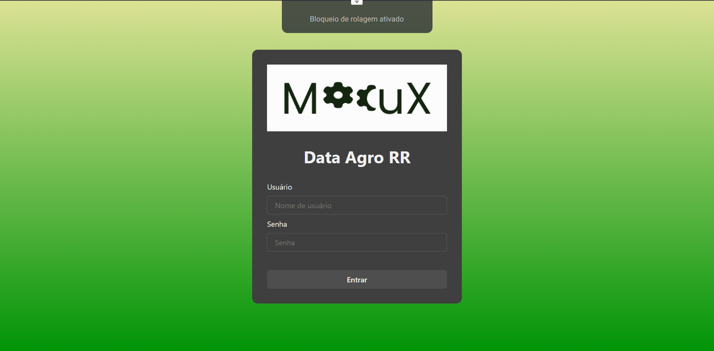
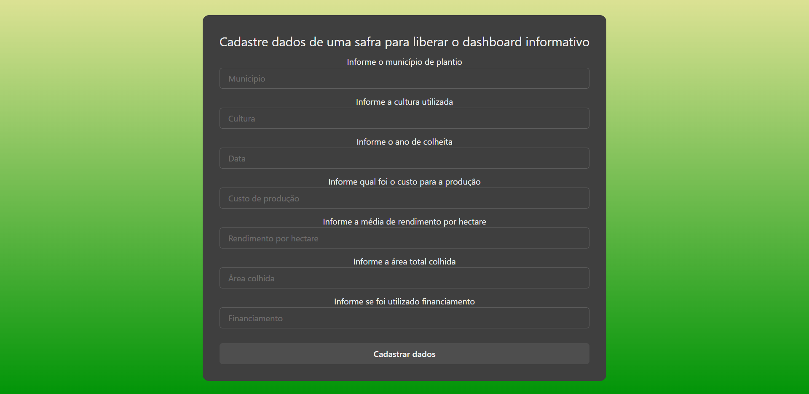

# Project-Macux

### Proposta

A equipe MacuX propõe a ideia de um dashboard de tratamento de dados alimentados por órgãos governamentais, produtores, coorporativas ativas, bancos e agrônomos em geral.

### Problema

- Escassez de dados na região
- Dados existentes incompletos

### Execulte o front-end

`npm start`

Rodar o projeto em modo desenvolvedor
Abrir [http://localhost:3000](http://localhost:3000) para ver no navegador.

# Prints do front

Home

Formulário
